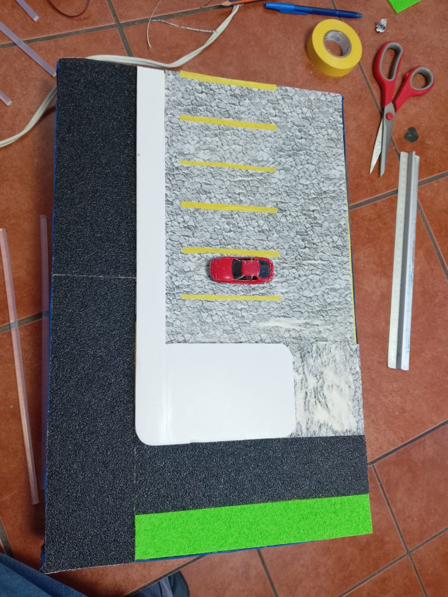
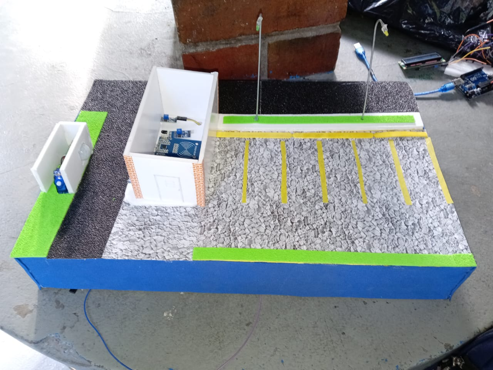
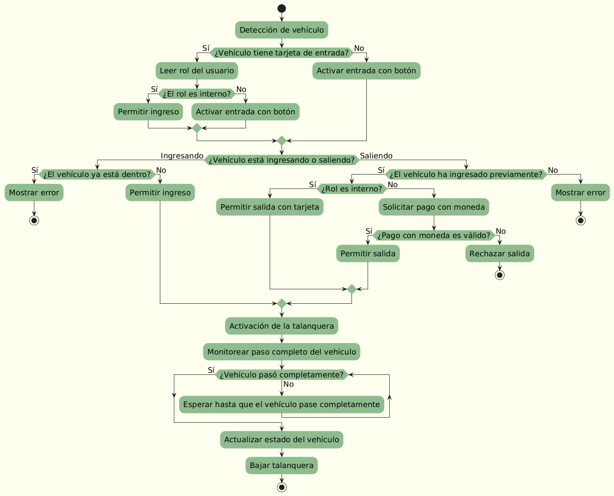

# Talanquera Inteligente

## Introducción

En la presente documentación se describe el proceso realizado para el desarrollo del proyecto “Sistema de Ingreso y Salida de Vehículos con IoT”. Este proyecto se basa en el concepto de Internet de las Cosas (IoT), que se refiere a la interconexión de dispositivos y tecnologías capaces de transferir datos a través de una red. En este documento, se detalla desde el planteamiento inicial con los bocetos del prototipo, hasta su implementación física, cumpliendo con los requisitos especificados para asegurar un control efectivo y seguro del acceso vehicular.

Este trabajo, evidenciado en la presente documentación y en el repositorio adjunto, incluye la utilización de diversos sensores y materiales para la construcción del sistema, que están integrados con un controlador adecuado para el procesamiento de datos. El sistema permite el monitoreo y validación del ingreso y salida de vehículos utilizando tecnologías como RFID, detección de roles, y pagos con monedas, asegurando que las respuestas de los componentes sean traducidas y gestionadas eficientemente para su visualización y control.

## Bocetos del prototipo

>    Primera propuesta.

>    Segunda propuesta.

>    Propuesta Final.

## Imagenes de construcción del prototipo

>    Construcción de divisiones del parqueo.

>    Construcción de garita y espacio para sensor y motor para talanquera.

## Capas del framework de IoT

## Product Infrastructure
### Listado de materiales fisicos:
- Sensor de temperatura y humedad
- Fotorresistencia
- Sensores de movimiento
- RFID
- Tarjeta de acceso
- Pantalla LCD
- Servo motor
- Arduino UNO
- Cables
- Carton de varios tipos
- Paletas de madera

### Sensors
- Sensor de temperatura y humedad DHT11
- Sensor infrarrojo de obstaculos LM393
- Modulo RFID RC522
- Motor servo SG90 de 180 grados
- Modulo de fotoresistencia 
- Pantalla LCD 1602
- Modulo I2C

### Connectivity

- Ubicacion de la maqueta: La maqueta creada debe de estar en un area abierta para tener correctas mediciones en los sensores de monitorizaje del clima, por lo que el lugar en el que estara ubicada es un patio, en una superficie plana, para que no se vean afectados los resultados de algunas mediciones.

- Envio de informacion: La informacion recolectada por los sensores es procesada por un arduino, al cual estan todos conectados por medio de un cable. Dichos datos seran enviados, por medio de conexion serial a
Processing y luego son enviados a la pantalla LCD para que se puedan ver en tiempo real.

### Analytics
- Calculos aplicados en la LCD

| Magnitud Fisica | Calculo  |
| --- | --- |
| Temperatura (°C) | Calculo a traves de sensor DHT11 |
| Humedad Relativa (%)| Calculo a traves de sensor DHT11 |
| Fotoresistencia| Calculo a traves del modulo |

- Librerias Utilizadas

| Libreria | Descripcion  |
| --- | --- |
| DHT | Es la que permite la comunicacion con los sensores DHT11 y DHT22, sensores de humedad/temperatura muy utiles para proyectos con Arduino |
| Wire| Esta libreria le permite comunicarse al arduino por medio de modulo interno i2c, ya sea como maestro a otros dispositivos o como esclavo recibiendo peticiones y respondiendo datos. |
| Adafruit_Sensor| Ayuda a muchos sistemas integrados pequeños para recopilar datos de los sensores, analizar los datos y tomar una accion adecuada o enviar los datos del sensor a otro sistema para su procesamiento. |

## Diagrama de Flujo completo

## Explicación de Interrupciones y Procedimientos

## Link del repositorio de github
[Enlace](https://github.com/KevinPalaciosQ/ACE2_2S24_G5/tree/main/PRACTICA1)