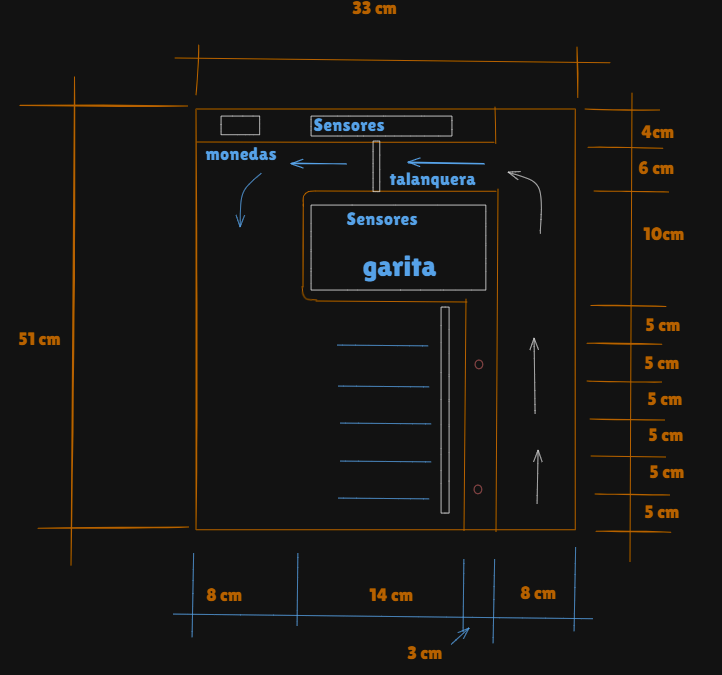

# Practica 1 - Monitoreo de tráfico vehicular en parqueo de la Facultad de Ingeniería, Fase 1 (Talanquera Inteligente)

## Introducción

En la epoca actual, el Internet de las Cosas (IoT) ha ido creciendo como una de las tecnologías más transformadoras del siglo XXI. Este concepto se refiere a la interconexión de dispositivos y objetos cotidianos a internet, permitiendo que estos recojan, envíen y reciban datos. 

Para aprovechar esta tecnología, se implementará la automatización de procesos en el parqueo, optimizando así el ingreso y salida de vehículos. Para cumplir con este propósito, se utilizarán sensores que recopilarán datos en tiempo real sobre la cantidad de vehículos, tiempo de permanencia, tipo de vehículo, condiciones climáticas, y si una persona pertenece o no a la universidad a través del uso de carnets RFID, entre otros aspectos. Para demostrar el funcionamiento de esta solución, se realizará la implementación de una maqueta.

## Bocetos del prototipo

>    Primera propuesta.

>    Segunda propuesta.

>    Propuesta Final.

## Imagenes de construcción del prototipo

>    Construcción de divisiones del parqueo.

>    Construcción de garita y espacio para sensor y motor para talanquera.

## Capas del framework de IoT

## Diagrama de Flujo completo

## Explicación de Interrupciones y Procedimientos

## Link del repositorio de github
[Enlace](https://github.com/KevinPalaciosQ/ACE2_2S24_G5/tree/main/PRACTICA1)