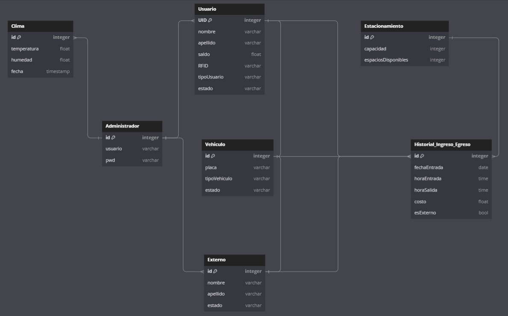
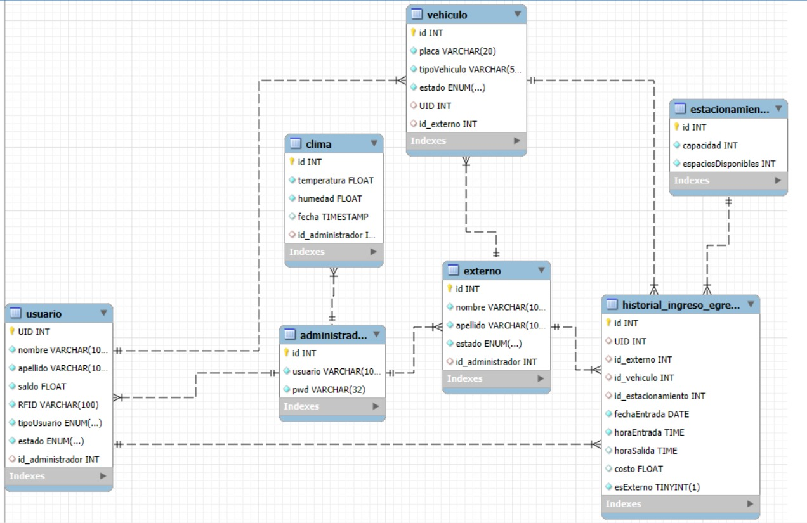
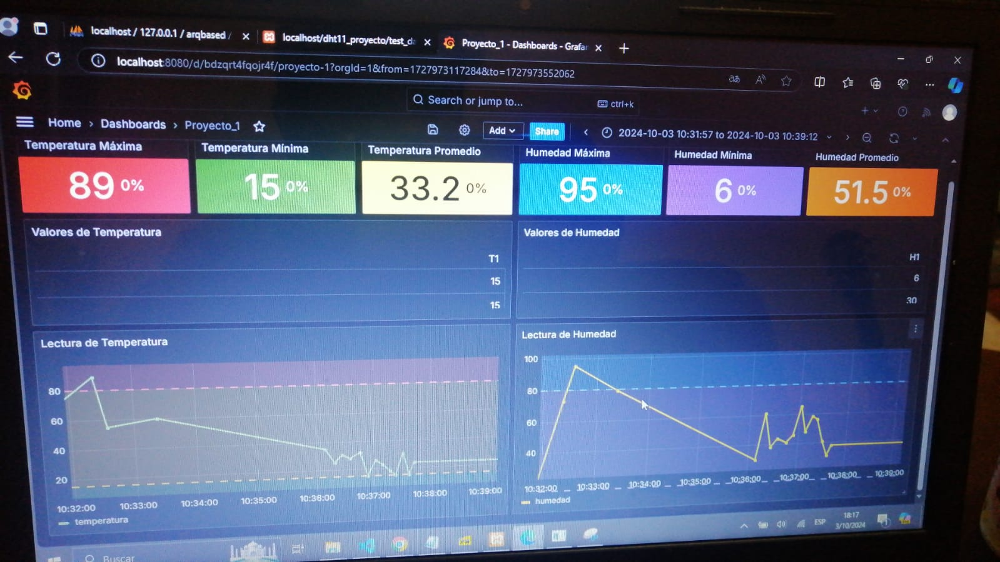

# Monitoreo de tráfico vehicular en parqueo de la Facultad de Ingeniería

## Descripción de la Solución

El proyecto consiste en el desarrollo de un sistema inteligente para la gestión de estacionamiento en la Facultad de Ingeniería de la Universidad de San Carlos de Guatemala. Este sistema integra varios componentes tecnológicos, como una base de datos MySQL, una API RESTful desarrollada en Python con Flask, un frontend creado con React, y un Arduino que actúa como dispositivo de entrada y monitoreo en tiempo real.

La solución se basa en el IoT (Internet of Things) y tiene como objetivo optimizar el uso de los espacios de estacionamiento, mejorar la experiencia de los usuarios y generar datos útiles para la gestión del parqueo. Entre las funcionalidades más destacadas se incluyen:

Gestión de Saldos mediante RFID: Se utiliza una base de datos para almacenar el saldo de los estudiantes y administrativos, que se descuenta automáticamente cada vez que ingresan al parqueo. Los datos de las tarjetas RFID se gestionan desde una plataforma web, permitiendo el monitoreo de los accesos y el saldo disponible en tiempo real.

Monitoreo Ambiental y de Ocupación del Parqueo: El Arduino envía datos sobre temperatura y humedad del estacionamiento a la API, que los almacena y los presenta en un panel de control a través del frontend. 

API: La API maneja las solicitudes tanto del sistema de ingreso como del frontend. Proporciona endpoints para registrar ingresos, obtener métricas del parqueo y gestionar usuarios, entre otros. Esto permite una comunicación eficiente y en tiempo real entre los distintos dispositivos y la base de datos.

Frontend: La plataforma web permite a los administradores monitorear el estado del parqueo y los datos de los usuarios, con gráficos y estadísticas actualizados en tiempo real. Además, se ofrece un sistema de autenticación para el acceso seguro a la interfaz de administración.

Integración con Arduino: El Arduino se encarga de capturar los datos de los sensores y enviar información relevante como la temperatura, humedad y los accesos al parqueo. Estos datos se procesan y envían a la API para su almacenamiento y posterior visualización en la interfaz web.

## Capas del Framework IoT

1. ### Listado de materiales fisicos:
- Sensor de temperatura y humedad
- Fotorresistencia
- Sensores de movimiento
- RFID
- Tarjeta de acceso
- Pantalla LCD
- Servo motor
- Arduino UNO
- Cables
- Carton de varios tipos
- Paletas de madera

2. ### Sensors
- Sensor de temperatura y humedad DHT11
- Sensor infrarrojo de obstaculos LM393
- Modulo RFID RC522
- Motor servo SG90 de 180 grados
- Modulo de fotoresistencia 
- Pantalla LCD 1602
- Modulo I2C


3. ### Connectivity

- Ubicacion de la maqueta: La maqueta creada debe de estar en un area abierta para tener correctas mediciones en los sensores de monitorizaje del clima, por lo que el lugar en el que estara ubicada es un patio, en una superficie plana, para que no se vean afectados los resultados de algunas mediciones.

- Envio de informacion: La informacion recolectada por los sensores es procesada por un arduino, al cual estan todos conectados por medio de un cable. Dichos datos seran enviados, por medio de conexion serial a
Processing y luego son enviados a la API, la cual se encarga de administrar los datos, haciendo las validaciones necesarias en conjunto con la base de datos, para despues ser enviados al frontend para su visualizacion.


4. ### Analytics
- Calculos aplicados en la API

| Calculos | Calculo  |
| --- | --- |
| Temperatura (°C) | Calculo a traves de la API |
| Humedad Relativa (%)| Calculo a traves de la API |
| Cantidad de Vehiculos | Capacidad total del estacionamiento, menos la cantidad de espacios disponibles |
| Saldo | Saldo del usuario menos el costos del parqueo |

- Librerias Utilizadas

| Libreria | Descripcion  |
| --- | --- |
| DHT | Es la que permite la comunicacion con los sensores DHT11 y DHT22, sensores de humedad/temperatura muy utiles para proyectos con Arduino |
| Wire| Esta libreria le permite comunicarse al arduino por medio de modulo interno i2c, ya sea como maestro a otros dispositivos o como esclavo recibiendo peticiones y respondiendo datos. |
| Adafruit_Sensor| Ayuda a muchos sistemas integrados pequeños para recopilar datos de los sensores, analizar los datos y tomar una accion adecuada o enviar los datos del sensor a otro sistema para su procesamiento. 
| Flask | Flask es un microframework de Python para desarrollar aplicaciones web. Es ligero, flexible y sencillo de usar, flask se utilizó para manejar las rutas y endpoints de la API que conectan el frontend con la base de datos. |
| mysql | MySQL se utilizó para almacenar la información de usuarios, accesos al parqueo, datos de clima, y establecer la conexion, ademas de otros registros necesarios para el funcionamiento del sistema.
| hashlib | Se utilizo hashlib que proporciona funciones de hash para cifrar datos. Se utilizó en este proyecto para generar hashes de las contraseñas en el sistema de login, asegurando que las credenciales del administrador se almacenen de manera segura en la base de datos utilizando técnicas como MD5 o SHA.|


5. **Capa de Aplicación**

En esta capa, se desarrolló el frontend utilizando React. La interfaz cuenta con un sistema de autenticación mediante una ventana de login dirigida a los administradores del sistema. Una vez autenticado, el administrador puede acceder a una segunda vista que muestra información en tiempo real sobre el clima del parqueo, incluyendo datos como la temperatura y humedad, además del estado de los parqueos, mostrando el número de espacios disponibles y ocupados. La interfaz también incluye un botón de logout, permitiendo al administrador cerrar sesión de forma segura y regresar a la pantalla de inicio de sesión.

## Modelo de la Base de Datos




### Tablas Principales
- **Administrador**: Campos [id, usuario, pwd.]
- **Usuarios**: Campos [UID, nombre, apellido, saldo, RFID, tipoUsuario, estado.]
- **Vehiculo**: Campos [id, placa, tipoVehiculo, estado.]
- **Clima**: Campos [id, temperatura, humedad, fecha.]
- **Historial**: Campos [id, fechaEntrada, horaEntrada, horaSalida, costo, esExterno.]

## Documentación de la API
A continuación se documentan los endpoints implementados en la API, desplegado por medio de POSTMAN.

[ENDPOINTS](https://documenter.getpostman.com/view/38574420/2sAXxMfYdd)


## Nomenclatura de los Topics utilizados
El Arduino envía los datos usando los siguientes topics:
- **Temperatura y humedad**:

  `LOGIN-Admin-860FA022, humidityText, temperatureText`

  `LOGIN-Student-D46BE373, humidityText, temperatureText`

- **Logout**:

  `LOGOUT-Admin-860FA022, humidityText, temperatureText`

  `LOGOUT-Admin-D46BE373, humidityText, temperatureText`

 - **Externos**:

   `LOGIN-External- , humidityText, temperatureText`

   `LOGOUT-External-XXXXXX, humidityText, temperatureText`


## Explicación de Métodos y Consultas Importantes a la Base de Datos
- **Consulta para obtener los usuarios**

  Descripción: Recupera los datos de los usuarios luego de la entrada.  
  Consulta:  `SELECT UID, nombre, apellido, saldo, Estado, tipoUsuario FROM Usuario WHERE RFID = %s;`
- **Consulta para obtener los valores del clima** 

  Descripción: Recupera la temperatura y humadad de los sensores por fecha.  
  Consulta:  `SELECT temperatura, humedad, fecha FROM Clima ORDER BY fecha DESC LIMIT 1;`
- **Consulta para los estacionaminetos** 

  Descripción: Recupera y calcula los espacios disponibles en el estacionamiento.  
  Consulta:  `SELECT espaciosDisponibles FROM Estacionamiento LIMIT 1;`
- **Consulta para el historial de entrada** 

  Descripción: Recupera los datos de entrada y salida del estacionamiento.  
  Consulta:  `SELECT h.id, h.fechaEntrada, h.horaEntrada, h.horaSalida, h.costo, v.tipoVehiculo, v.placa FROM Historial_Ingreso_Egreso h LEFT JOIN Vehiculo v ON h.UID = v.UID WHERE h.UID = %s ORDER BY h.fechaEntrada DESC, h.horaEntrada DESC;`


## Explicación de la Gráfica Animada
La visualización de los datos del parqueo se realiza mediante graficas realizadas en grafana, estas graficas muestran la temperatura y humedad.  

Herramienta utilizada: [Grafana] 




## Scripts para Consultar la Base de Datos
A continuación se proporcionan los scripts SQL necesarios para realizar consultas durante la evaluación del proyecto.

- **Consultas para la base de datos**  
  ```sql
    SELECT * FROM administrador;
    SELECT * FROM usuario;
    SELECT * FROM externo;
    SELECT * FROM vehiculo;
    SELECT * FROM estacionamiento;
    SELECT * FROM clima;
    SELECT * FROM historial_ingreso_egreso;
